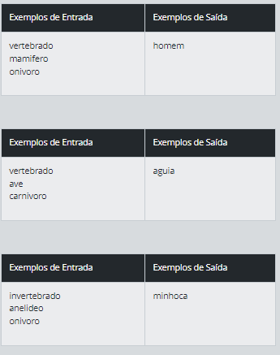
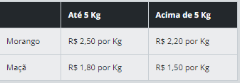
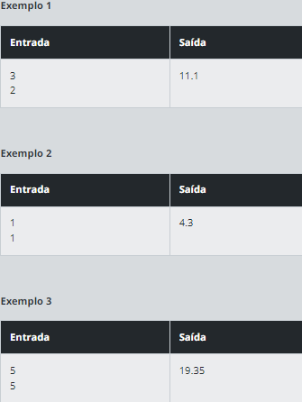
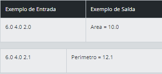

# **Desafios DIO**

## **Animal**

- **DESAFIO**

Neste problema, você deverá ler 3 palavras que definem o tipo de animal possível segundo o esquema abaixo, da esquerda para a direita.  Em seguida conclua qual dos animais seguintes foi escolhido, através das três palavras fornecidas.

- **Entrada**

A entrada contém 3 palavras, uma em cada linha, necessárias para identificar o animal segundo a figura acima, com todas as letras minúsculas.

- **Saída**

Imprima o nome do animal correspondente à entrada fornecida.

## **Quitanda do seu Zé**

- **Desafio**

Seu Zé está vendendo frutas com a seguinte tabela de preços:

Se o cliente comprar mais de 8 Kg em frutas ou o valor total da compra ultrapassar R$ 25,00, receberá ainda um desconto de 10% sobre este total. Escreva um algoritmo para ler a quantidade (em Kg) de morangos e a quantidade (em Kg) de maças adquiridas e escreva o valor a ser pago pelo cliente.

- **Entrada**

Como entrada, você recebera a quantidade em kg de morangos e a quantidade em kg de maçãs.

- **Saída**

Será o valor a ser pago pelo cliente, conforme a tabela de preços da quintanda do seu Zé.

## **Triângulo**

- **Desafio**

Leia 3 valores reais (A, B e C) e verifique se eles formam ou não um triângulo. Em caso positivo, calcule o perímetro do triângulo (soma de todos os lados) e apresente a mensagem:

***Perimetro = XX.X***

Em caso negativo, calcule a área do trapézio que tem A e B como base e C como altura, mostrando a mensagem:

***Area = XX.X***

Fórmula da área de um trapézio: AREA = ((A + B) x C) / 2

- **Entrada**

A entrada contém três valores reais.

- **Saída**

O resultado deve ser apresentado com uma casa decimal.

